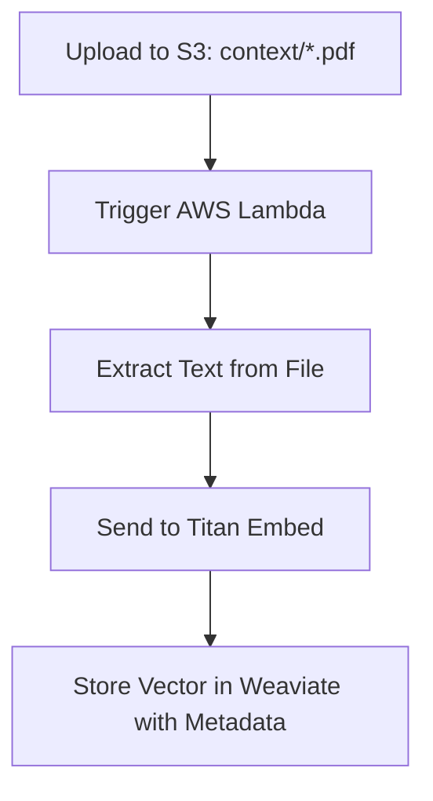

# 🧠 ContextQ: Production-Ready RAG Backend with Amazon Bedrock, Weaviate & AWS

ContextQ is a scalable, open-source Retrieval-Augmented Generation (RAG) backend designed for production environments. Built with **Node.js**, **Express**, and **Sequelize**, it integrates **Amazon Bedrock**, **Weaviate**, and **AWS S3** to deliver fast vector search, modular ingestion, and powerful LLM-driven responses.

> 💡 API-first design. Plug into any frontend or orchestration layer.

---

## 📚 Table of Contents

- [📦 Overview](#-overview)
- [⚙️ Node.js Setup](#️-nodejs-setup)
- [🗃️ SQL Setup (MySQL 8.x)](#️-sql-setup-mysql-8x)
- [🧠 Weaviate Vector DB Setup](#-weaviate-vector-db-setup)
  - [⚡ Auto-Start Weaviate on EC2 Boot](#-auto-start-weaviate-on-ec2-boot)
- [🔐 Environment Variables](#-environment-variables)
- [🧬 Core Models](#-core-models)
- [📈 Document Ingestion Flow](#-document-ingestion-flow)
- [📦 AWS Services](#-aws-services)
- [✅ Conclusion](#-conclusion)
- [📄 License](#-license)

---

## 📦 Overview

This backend powers GenAI applications like:

- 🔍 Semantic search over private documents
- 🧠 AI-based question generation
- 🤖 LLM chat with custom context
- 📝 Domain-specific summarization and QA systems

---

## ⚙️ Node.js Setup

```bash
# Prerequisites
- Node.js v18+
- npm
- AWS CLI configured

# Install Dependencies
cd backend
npm install
```

---

## 🗃️ SQL Setup (MySQL 8.x)

```bash
# Create MySQL Database
CREATE DATABASE <your-db-name>;

# Sequelize auto-creates tables based on models
```

---

### 📌 MySQL Installation and Setup on Amazon Linux 2023

```bash
# Step 1: Switch to Root User
sudo su

# Step 2: Download and Install MySQL Repository
wget https://dev.mysql.com/get/mysql80-community-release-el9-1.noarch.rpm
dnf install mysql80-community-release-el9-1.noarch.rpm -y

# Step 3: Import MySQL GPG Key
rpm --import https://repo.mysql.com/RPM-GPG-KEY-mysql-2023

# Step 4: Install MySQL Client and Server
dnf install mysql-community-client -y
dnf install mysql-community-server -y

# Step 5: Start and Enable MySQL Service
systemctl start mysqld
systemctl enable mysqld
systemctl status mysqld

# Step 6: Retrieve Temporary Root Password
sudo grep 'temporary password' /var/log/mysqld.log

# Step 7: Login and Change Root Password
mysql -u root -p
ALTER USER 'root'@'localhost' IDENTIFIED BY 'StrongPassword!';
FLUSH PRIVILEGES;

# Step 8: Create Database and User
CREATE DATABASE <your-db-name>;
CREATE USER '<your-db-user>'@'%' IDENTIFIED BY 'strong_password';
GRANT ALL PRIVILEGES ON <your-db-name>.* TO '<your-db-user>'@'%';
FLUSH PRIVILEGES;

# Step 9: Configure Application Database Connection
Set the following environment variables:
DB_NAME=<your-db-name>
DB_USER=<your-db-user>
DB_PASSWORD=strong_password
DB_HOST=your-mysql-server-ip-or-hostname
DB_PORT=3306
```

---

## 🧠 Weaviate Vector DB Setup

Deployed on a **dedicated EC2 instance** with persistent volume.

```bash
# Step 1: Launch Ubuntu EC2 (t3.medium, 20GB)

# Step 2: Install Docker
sudo apt update && sudo apt install -y docker.io docker-compose
sudo systemctl enable docker && sudo systemctl start docker

# Step 3: Create setup directory
mkdir -p ~/weaviate/weaviate_data && cd ~/weaviate

# Step 4: docker-compose.yml
nano docker-compose.yml
```

```yaml
version: "3.4"
services:
  weaviate:
    image: semitechnologies/weaviate:1.25.3
    ports:
      - "8080:8080"
    volumes:
      - ./weaviate_data:/var/lib/weaviate
    environment:
      QUERY_DEFAULTS_LIMIT: 25
      AUTHENTICATION_ANONYMOUS_ACCESS_ENABLED: "true"
      PERSISTENCE_DATA_PATH: "/var/lib/weaviate"
      DEFAULT_VECTORIZER_MODULE: "none"
      CLUSTER_HOSTNAME: "node1"
```

Visit: `http://<your-ec2-ip>:8080`

---

### ⚡ Auto-Start Weaviate on EC2 Boot

To ensure Weaviate starts automatically after an EC2 reboot, paste the following config in `/etc/systemd/system/weaviate.service`:

```bash
# Step 5: Create a systemd service
sudo nano /etc/systemd/system/weaviate.service

[Unit]
Description=Weaviate Docker Compose Service
Requires=docker.service
After=docker.service

[Service]
Type=oneshot
RemainAfterExit=yes
WorkingDirectory=/root/weaviate
ExecStart=/usr/bin/docker-compose up -d
ExecStop=/usr/bin/docker-compose down

[Install]
WantedBy=multi-user.target
```

## 🔐 Environment Variables

Create your `.env` file based on the following:

```env
# BACKEND PORT
PORT=8000

# AWS CONFIGURATIONS
AWS_ACCESS_KEY_ID=
AWS_SECRET_ACCESS_KEY=
AWS_REGION=us-east-1

# DOCUMENT BUCKET INFO
BUCKET_NAME=context-docs-bucket

# GEN-AI WORKLOADS
WEAVIATE_URL=http://<weaviate-ec2-ip>:8080
BEDROCK_REGION=us-east-1
LLM_MODEL_ID=anthropic.claude-v2
EMBEDDING_MODEL_ID=amazon.titan-embed-text-v1

# DATABASE CONFIGURATIONS
DB_HOST=<your-db-host>
DB_PORT=3306
DB_USER=<your-db-user>
DB_PASSWORD=strong_password
DB_NAME=ai_interviewer
DB_DIALECT=mysql
```

---

## 🧬 Core Models

- `User`: Role-based user model (Admin, EndUser, Vendor, etc.)
- `Document`: Tracks uploaded files and metadata
- `VectorStore`: Maps document to Weaviate vector ID
- `Question`: Stores LLM-generated questions
- `Team`: Used for admin/vendor allocation
- `Complaint`: Support/issue tracking

Each model is associated using Sequelize with MySQL and supports extensible relations.

---

## 📈 Document Ingestion Flow



---

## 📦 AWS Services

- **Amazon Bedrock**

  - Used for generating **embeddings** via Amazon Titan
  - Also used for **LLM inference** (e.g., Claude, Command R)

- **S3 (Simple Storage Service)**

  - Stores uploaded documents under the `context/` folder
  - Triggers downstream processing upon upload

- **AWS Lambda**
  - Automatically triggered when a new document is uploaded to S3
  - Workflow:
    1. Extracts content from PDF/DOCX/TXT
    2. Sends content to Titan embedding model
    3. Stores resulting vector in Weaviate with metadata

---

## ✅ Conclusion

ContextQ is built with extensibility and production-readiness in mind. It supports modular integrations with any LLM or vector database, and is easily deployable on any AWS stack.

> Want to contribute or extend? Fork it, plug in your models, and scale.

---

## 📄 License

MIT © 2025 Atharva Jagtap
